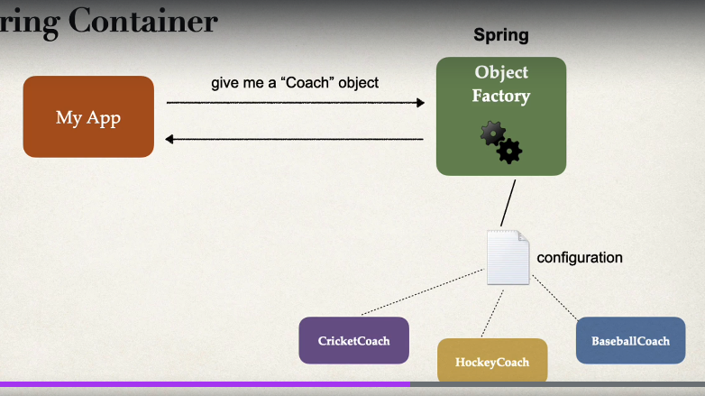

# Inversion of Control (IoC)

- what is it?
- Is a factory that produces an object instance stored somewhere
- spring container produces the object
- spring containers functions: create and manage object, inject object dependencies
- IoC container manages the dependencies
- Dependency injection (DI) is a form of IoC
- good for unit testing, swap dependencies and louse coupling



## Example:

- without IoC:

```java
class Client {
    private Cooker cooker;
    public Cliend() {
        this.cooker = new Cooker(); // <- client must implement the dependency
    }
}
```

- with IoC

```java
class Client {
    private Cooker cooker;
    public Client(Cooker cooker) { 
        // inversion of control, client does not know the implementation
        // dependency is injected
        this.cooker = cooker;
    }
}
```

- with spring IoC
```java
class Client {
    private Cooker cooker;
    
    @Autowired // cooker must have @Component and is injected by spring container
    public Client(Cooker cooker) {
        this.cooker = cooker;
    }
}
```

- advantages:
  - louse coupling
  - reusable
  - use interface to make it batter, do not depend on implementation

- ways to configure IoC
  - XML config file (legacy)
  - Java annotation
  - java source code

# Overview

- types of injection:
  - setter injection
    - for option dependencies
  - constructor injection
    - use when have required dependencies
    - first choice

- @autowired
  - spring look for classes matches
  - type class or interface
  - scan for components
  - if u use constructor with interface param and have only one implementation, spring solve it
  - @Autowired is option if only one constructor

- @component
  - regular java class managed by spring
  - makes class available for dependency injection

- recommend flow:
  - interface -> implementation with @Component -> @Autowired in constructor client